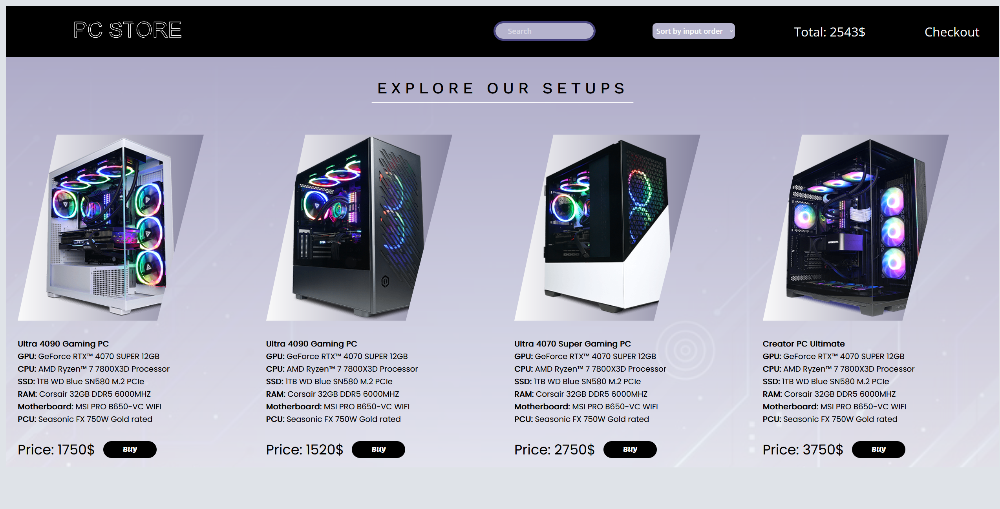

# pc-shop
Creating a PC Shop using React, JavaScript, SCSS 

Still in process of adding more features and making the project responsive and interact with back-end services

The goal of this repo is to practice the following skill sets:

 
   - **React**:
        - `useState`
        - `useRef`
        - `how to deal with side effects`
        
   - **SCSS**: 
        - `syntax`
        - `modules`
        - `responsivness`

## Links

[Live Demo](https://pc-shop-ey0hv0l73-frenzy017s-projects.vercel.app/)

## Screenshots

> Normal View / Desktop Layout

